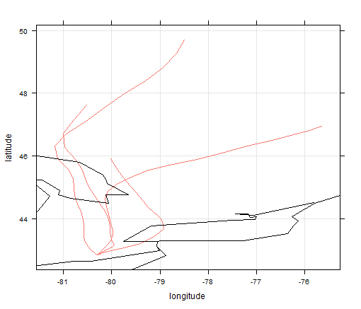

SplitR
======

SplitR is a package that's great for conducting trajectory and dispersion modelling with [NOAA HYSPLIT](http://ready.arl.noaa.gov/HYSPLIT.php).

## Installation

Easy installation of SplitR from GitHub is entirely possible with the `devtools` package:

```coffee
require(devtools)
install_github('SplitR', 'rich-iannone')
```

## Description

SplitR allows you set up and run HYSPLIT in a very fast, easy, and organized manner. You easily set up a few or, perhaps, thousands of trajectory or dispersion runs using a single function. Because SplitR is an R interface to HYSPLIT, we can store output in data frames and do things with it (e.g., perform cluster analyses, generate and save plots, etc.). The package sets up the folders, gets the HYSPLIT binaries, automates the downloading and storage of meteorological data files, and encourages you to make presets for dispersion model runs.

This package is in active development but is quite usable at present. Some of its features are:

- automatic downloading and installation of HYSPLIT binary executables
- organization of modelling presets and output through the SplitR project framework
- automated retrieval of meteorological data files
- simple setup of trajectory and dispersion model runs (forward or backward)
- numerous batching options: set up models to run continuously with multiple start times throughout a single year, several years, or a predefined time range
- trajectory plotting and visualization of particle positions in dispersion runs
- clustering of trajectories and plotting of clusters

## Setup

Use of SplitR requires a basic installation of HYSPLIT, as obtained from the Air Resources Laboratory (ARL) of the National Oceanic and Atmospheric Administration (NOAA) [READY website](http://ready.arl.noaa.gov/HYSPLIT.php). 

For Windows installations, there are both [registered](http://ready.arl.noaa.gov/hyreg/HYSPLIT_pchysplit.php) and [unregistered](http://ready.arl.noaa.gov/HYSPLIT_hytrial.php) versions of the HYSPLIT package. The only difference in functionality between the two packages is that the unregistered version cannot perform model runs with forecast meteorological data. Either of the packages comes with an installer that will place the main HYSPLIT folder (named 'hysplit') in the location of your choice. Within this main folder, there are 15 subdirectories.

For a Mac OS X installation, there is a [single package](http://ready.arl.noaa.gov/hyreg/HYSPLIT_applehysp.php) that has all functionality included.

Take note of the paths for the HYSPLIT executables and` working directory (in the subfolders 'exec' and 'working'). You can optionally create additional subfolders for locating HYSPLIT-ready meteorological data files, or, opt to place those in the HYSPLIT working directory.

## Example for Running a Series of HYSPLIT Trajectory Runs

To perform a series HYSPLIT trajectory model runs, use the SplitR `hysplit.trajectory` function:

```coffee
hysplit.trajectory(start_lat_deg = 42.83752, start_long_deg = -80.30364,
                   start_height_m_AGL = 5, simulation_duration_h = 24,
                   backtrajectory = FALSE,
                   met_type = "gdas1",
                   vertical_motion_option = 0,
                   top_of_model_domain_m = 20000,
                   run_type = "day", run_day = "2012-03-12",
                   daily_hours_to_start = c("00", "06", "12", "18"),
                   path_met_files =  "C:\\Users\\[username]\\Desktop\\hysplit4\\working\\",
                   path_output_files = "C:\\Users\\[username]\\Desktop\\hysplit4\\working\\",
                   path_wd = "C:\\Users\\[username]\\Desktop\\hysplit4\\working\\",
                   path_executable = "C:\\Users\\[username]\\Desktop\\hysplit4\\exec\\") 
```

This use of `hysplit.trajectory` sets up four trajectory runs that start at 00:00, 06:00, 12:00, and 18:00 UTC on March 12, 2012. These initial times are set using `run_type = "day"`, `run_day = "2012-03-12"`, and `daily_hours_to_start = c("00", "06", "12", "18")`. The model runs are forward runs (moving forward in time, set here using `backtrajectory = FALSE`) and not backtrajectory runs (set with `backtrajectory = TRUE`). These runs are 24 h in duration (`simulation_duration_h = 24`). The starting location of 42.83752ºN and 80.30364ºW is set using `start_lat_deg = 42.83752` and `start_long_deg = -80.30364`; the starting height of 5 m above ground level is set by `start_height_m_AGL = 5`. The meteorological options include the type of met data to use (1º GDAS data is used here with `met_type = "gdas1"`--there is also the option to use NCEP reanalysis data with the `met_type = "reanalysis"` setting), the vertical motion option (here, set as `vertical_motion_option = 0` which instructs HYSPLIT to use the vertical motion available in the met data files), and, the top of the model domain (set as 20,000 meters with `top_of_model_domain_m = 20000`). Four paths require specification:

- path to the meteorological data files (`path_met_files`)
- path to the output files (`path_output_files`)
- path to the working directory (`path_wd`)
- path to the executable directory, specifically here to that path containing the `hyts_std` executable (`path_executable`)

All paths should exist (i.e., SplitR won't create directories) and the paths provided in the above `hysplit.trajectory()` example should serve as recommendations for these path settings. If running in a Mac OS X environment, use appropriate paths with forward slashes (paths using a tilde are acceptable).

The necessary meteorological data files relevant to the period being modelled with be downloaded from the NOAA FTP server (arlftp.arlhq.noaa.gov) if they are not present in the directory specified as the `path_met_files` argument. Note that SplitR does not currently provide an option to automatically delete these downloaded data files after the relevant model runs have been completed, so, keep in mind that available disk space may be issue with longer sequences of model runs (e.g., a GDAS1 met file for a week-long period can take up to 600 MB of disk space).

After this, 4 files should be generated and residing in the 'working' folder:

- `traj(forward)-12-03-12-00-lat_42.83752_long_-80.30364-height_5-24h`
- `traj(forward)-12-03-12-06-lat_42.83752_long_-80.30364-height_5-24h`
- `traj(forward)-12-03-12-12-lat_42.83752_long_-80.30364-height_5-24h`
- `traj(forward)-12-03-12-18-lat_42.83752_long_-80.30364-height_5-24h`

A data frame can be generated from these output files using the SplitR `trajectory.read` function:

```coffee
trajectory.df <- trajectory.read(path_output_files = "C:\\Users\\[username]\\Desktop\\hysplit4\\working\\",
                                 year = NULL,
                                 start_height_m_AGL = NULL)
```

With this data frame, statistical analyses for the trajectories can be generated (e.g., average heights of trajectories after specified time periods, etc.). Furthermore, the `trajectory.df` data frame is fully compatible with the excellent 'openair' package that is available on CRAN. Plotting of the trajectory output data frame requires use of openair's `trajPlot` function:

```coffee
trajPlot(trajectory.df, map.fill = FALSE)
```

Here are the trajectories from those model runs:




## Future Additions to SplitR

- greater support for different types of meteorological data files
- options for merging data frames of backtrajectories with pollutant concentrations for advanced air quality analyses
- statistical summaries for dispersion of particles
- ensemble model runs
- capability for the starting location to be moving during successive model runs
