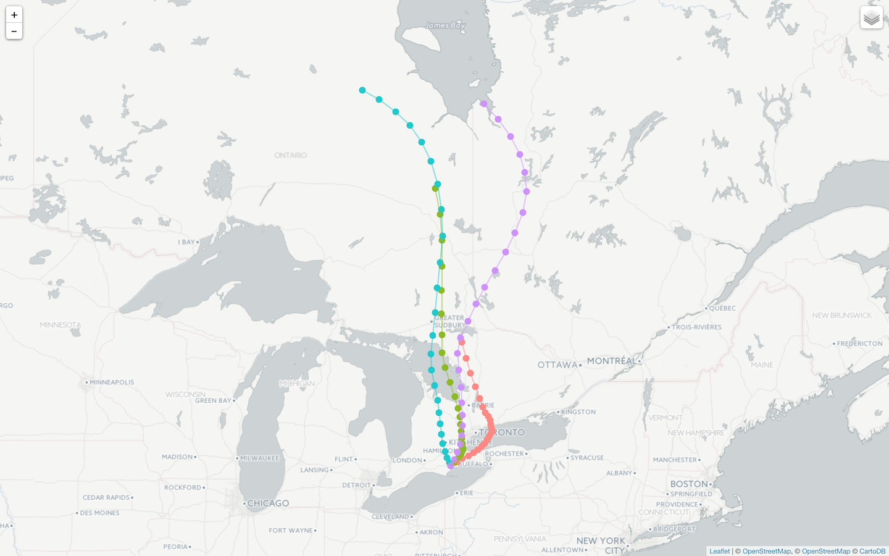

<!-- README.md is generated from README.Rmd. Please edit that file -->

# splitr 

<!-- badges: start -->

[](https://travis-ci.org/rich-iannone/splitr)
[](https://zenodo.org/badge/latestdoi/20543/rich-iannone/SplitR)
<!-- badges: end -->

**splitr** is an **R** package for conducting trajectory and dispersion
modeling with **HYSPLIT**. We can determine, from one or more receptor
sites, where arriving air masses originated. Conversely, it’s possible
to model trajectories of air masses from receptor sites. Forward and
backward modeling of gas-phase or particulate matter can also be
conducted from defined sites. It’s a means to help explain how, where,
and when chemicals and materials are atmospherically transported,
dispersed, and deposited.

This model has many applications. Some have modeled the atmospheric
transport of moisture to determine probable extreme rainfall locations
leading to flood events ([Gustafsson et
al., 2010](http://tellusa.net/index.php/tellusa/article/view/15715)).
Similarly, [Creamean et
al., 2013](http://science.sciencemag.org/content/339/6127/1572.full)
have presented a direct link between long-range transported dust and
biological aerosols affecting cloud ice formation and precipitation
processes in western United States.

Others have successfully improved understanding of invasive species
dispersal abilities to inform conservation and landscape management
([Lander et
al., 2014](http://onlinelibrary.wiley.com/doi/10.1002/ece3.1206/abstract)).
Along similar lines, the long-distance transport of high-risk plant
pathogens can be modeled with **HYSPLIT** to assist with plant disease
management decisions, such as applications of fungicide or pesticide to
potentially-affected agricultural areas ([Schmale and
Ross, 2015](http://www.annualreviews.org/doi/abs/10.1146/annurev-phyto-080614-115942?journalCode=phyto)).

**splitr** allows you to build and run **HYSPLIT** models in a fast,
easy, and organized manner. A few or, perhaps, thousands of trajectory
or dispersion runs can be conducted with minimal code. Because
**splitr** is an **R** interface to **HYSPLIT**, we can store output in
memory and take advantage of the vast selection of **R** packages to
perform statistical analyses and to generate visualizations. This
package furthermore simplifies the process of running **HYSPLIT** models
by automating the retrieval and storage of associated meteorological
data files.

Some of the things you can do with **splitr** are:

  - create and execute model runs with an easily readable **magrittr**
    pipeline workflow
  - run multiple trajectory and dispersion model runs (forward or
    backward) with multiple temporal and spatial variations
  - visualize wind trajectories and particle positions throughout
    trajectory and dispersion runs
  - use the returned `tbl_df` object with **dplyr** to `filter()`,
    `select()`, `group_by()`, `summarize()`, `mutate()`, and
    `transmute()` the model output data

## **HYSPLIT** Trajectory Model Runs

To perform a series of **HYSPLIT** trajectory model runs, one can use
the **splitr** `hysplit_trajectory()` function:

``` r
library(splitr)
library(here)

trajectory <- 
  hysplit_trajectory(
    lat = 42.83752,
    lon = -80.30364,
    height = 50,
    duration = 24,
    days = "2012-03-12",
    daily_hours = c(0, 6, 12, 18),
    direction = "forward",
    met_type = "gdas1",
    extended_met = TRUE,
    met_dir = here::here("met"),
    exec_dir = here::here("out")
  ) 
```

This use of `hysplit_trajectory()` sets up four trajectory runs that
start at 00:00, 06:00, 12:00, and 18:00 UTC on March 12, 2012 (using
`days = "2012-03-12"` and `daily_hours = c(0, 6, 12, 18)`). These runs
are 24 h in duration (`duration = 24`).

The receptor/origin locations are set using `lat` and `lon` for the
latitude(s) and longitude(s). The starting location of 42.83752ºN and
80.30364ºW is set here using `lat = 42.83752` and `lon = -80.30364`.
Equal-length vectors of `lat` and `lon` values can be used here to
create an ensemble of model runs. The starting height of 50 m above
ground level is set by `height = 50`.

The model runs as set above are forward runs (moving forward in time,
set here using `direction = "forward"`) and not backtrajectory runs (set
with `direction = "backward"`).

The meteorological options include the type of met data to use. The 1º
**GDAS** data is used here with `met_type = "gdas1"` but there is also
the option to use **NCEP** reanalysis data with the `met_type =
"reanalysis"` setting and **NARR** (North American Regional Reanalysis)
data with `met_type = "narr"`. The necessary meteorological data files
relevant to the period being modeled will be downloaded from the
**NOAA** FTP server if they are not present in the working directory.

The function will return a data frame containing trajectory information.
The data frame (named here as the object `trajectory`) will be have the
following columns when `extended_met` is set to `FALSE`:

  - `run` the index value for an individual model run
  - `receptor` a numeric label for the receptor, which is a
    3-dimensional position
  - `hour_along` the integer hour difference (positve for forward
    trajectories, negative for backward trajectories) for the trajectory
    position compared to the run starting time
  - `traj_dt` the date-time value for the trajectory location
  - `lat`, `lon`, `height` the latitude, longitude, and height (meters
    above ground level) of the air mass along the trajectory
  - `traj_dt_i`, `lat_i`, `lon_i`, `height_i` the initial values (at the
    model start) for `traj_dt`, `lat`, `lon`, and `height`
  - `pressure` the air pressure at each position and time along the
    trajectory (in hPa)

If the model is run with `extended_met` set to `TRUE` then the following
along-trajectory values will also be available in the output tibble:

  - `theta` the potential temperature (in K)
  - `air_temp` the ambient air temperature (in K)
  - `rainfall` the rate of rainfall (in mm/h)
  - `mixdepth` the mixing depth (or mixing height, in meters)
  - `rh` the relative humidity
  - `sp_humidity` the specific humidity (in g/kg)
  - `h2o_mixrate` the mixed layer depth (in meters)
  - `terr_msl` the terrain height at the location defined by `lat` and
    `long`
  - `sun_flux` the downward solar radiation flux (in watts)

Models can also be defined and executed using a modeling object in a
**magrittr** workflow. Here’s an example:

``` r
# Create the `trajectory_model` object, add
# various parameters with `add_trajectory_params()`,
# and execute the model runs
trajectory_model <-
  create_trajectory_model() %>%
  add_trajectory_params(
    lat = 43.45,
    lon = -79.70,
    height = 50,
    duration = 6,
    days = "2015-07-01",
    daily_hours = c(0, 12),
    direction = "backward",
    met_type = "reanalysis",
    met_dir = here::here("met"),
    exec_dir = here::here("out")
  ) %>%
  run_model()
```

Here, we create a `trajectory_model` object which serves as a container
for the model definition and for the results.

This pipeline setup allows for more flexibility as **R** objects can be
piped in for variation in the types of models created. The
`create_trajectory_model()` function creates the trajectory model
object. One or more `add_trajectory_params()` statements can be used to
write model parameters to the model object. Ending the pipeline with
`run_model()` runs the model and creates results.

The trajectory data can be be extracted from the trajectory model object
using the `get_output_tbl()` function.

``` r
# Get a data frame containing the model results
trajectory_tbl <- trajectory_model %>% get_output_tbl()

trajectory_tbl
```

…and a tibble of output data is returned:

``` r
#> # A tibble: 14 x 21
#>      run receptor hour_along traj_dt               lat   lon height
#>    <int>    <int>      <int> <dttm>              <dbl> <dbl>  <dbl>
#>  1     1        1          0 2015-07-01 00:00:00  43.4 -79.7   50  
#>  2     1        1         -1 2015-06-30 23:00:00  43.4 -79.7   44.1
#>  3     1        1         -2 2015-06-30 22:00:00  43.3 -79.8   39  
#>  4     1        1         -3 2015-06-30 21:00:00  43.3 -79.8   34.5
#>  5     1        1         -4 2015-06-30 20:00:00  43.2 -79.7   30.7
#>  6     1        1         -5 2015-06-30 19:00:00  43.2 -79.7   27.4
#>  7     1        1         -6 2015-06-30 18:00:00  43.1 -79.7   24.5
#>  8     2        1          0 2015-07-01 12:00:00  43.4 -79.7   50  
#>  9     2        1         -1 2015-07-01 11:00:00  43.5 -79.9   44.6
#> 10     2        1         -2 2015-07-01 10:00:00  43.5 -80.1   40.7
#> 11     2        1         -3 2015-07-01 09:00:00  43.5 -80.2   37.7
#> 12     2        1         -4 2015-07-01 08:00:00  43.6 -80.4   35.7
#> 13     2        1         -5 2015-07-01 07:00:00  43.6 -80.5   34.4
#> 14     2        1         -6 2015-07-01 06:00:00  43.6 -80.6   33.8
#> # … with 14 more variables: traj_dt_i <dttm>, lat_i <dbl>, lon_i <dbl>,
#> #   height_i <dbl>, pressure <dbl>, theta <dbl>, air_temp <dbl>,
#> #   rainfall <dbl>, mixdepth <dbl>, rh <dbl>, sp_humidity <dbl>,
#> #   h2o_mixrate <dbl>, terr_msl <dbl>, sun_flux <dbl>
```

#### Plotting Trajectory Data

Trajectories can be plotted onto an interactive map. Use the
`trajectory_plot()` function with either the `trajectory` data frame
(created directly by the `hysplit_trajectory()` function)…

``` r
# Plot results using the trajectory data frame
trajectory_tbl %>% trajectory_plot()
```

…or, with a trajectory model object

``` r
# Plot results using the trajectory model object
trajectory_model %>% trajectory_plot()
```

The visualization will appear in the **RStudio** Viewer:



The trajectory points and paths are layers where their visibility can be
toggled using the *Layers* icon at the top-right of the view. The
following selection of basemaps is also provided:

  - CartoDB Dark Matter
  - CartoDB Positron
  - ESRI World Terrain
  - Stamen Toner

Clicking any of the points along the trajectory will provide an
informative popup with time/position info for that location at that
point in time:


## **HYSPLIT** Dispersion Runs

Dispersion models can also be conveniently built and executed. Begin the
process with the `create_disp_model()` function. Use one or more
`add_dispersion_params()` statements to write parameters to the model
object. The `add_grid()` function here facilitates the creation of
sampling grids. Using the `add_emissions()` function anywhere in the
pipeline will define emissions properties for one or more emitted
pollutants. With `add_species()`, the physical properties and deposition
parameters of one or more emitted species can be added to the model.

As with the trajectory model, the pipeline can ended with `run_model()`.
To extract a data frame containing the modeled output data, use the
`get_output_df()` function. An example is in order:

``` r
library(splitr)
library(lubridate)
library(here)

# Create the `dispersion_model` object, add
# a grid of starting locations, add run
# parameters, and then execute the model run
dispersion_model <-
  create_dispersion_model() %>%
  add_source(
    name = "particle",
    lat = 49.0, lon = -123.0, height = 50,
    rate = 5, pdiam = 15, density = 1.5, shape_factor = 0.8,
    release_start = lubridate::ymd_hm("2015-07-01 00:00"),
    release_end = lubridate::ymd_hm("2015-07-01 00:00") + lubridate::hours(2)
  ) %>%
  add_dispersion_params(
    start_time = lubridate::ymd_hm("2015-07-01 00:00"),
    end_time = lubridate::ymd_hm("2015-07-01 00:00") + lubridate::hours(6),
    direction = "forward", 
    met_type = "reanalysis",
    met_dir = here::here("met"),
    exec_dir = here::here("out")
  ) %>%
  run_model()
```

This dispersion model formally begins at 00:00 UTC on July 1, 2015
(using the `start_time` argument). The model run is a forward run (i.e.,
moving forward in time, with `direction = "forward"`) and not backwards
(which could be set with `direction = "backward"`). Essentially, running
in forward mode means the starting location is a source of emissions;
running backward means that the starting location is a receptor.

This run has been set to be modeled for 6 h. The starting location of
49.0ºN and 123.0ºW is set using `lat = 49.0` and `lon = -123.0`; the
starting height of 50 m above ground level is set by `height = 50`. The
meteorological options include the type of met data to use (global NCEP
Reanalysis data is used here with `met_type = "reanalysis`).

A single emissions species is set to be emitted (using `add_source()`)
for 2 hours at an emission rate of 5 mass units per hour (`rate = 5`).
Emissions begin at the same time as the start of the model
(`release_start = lubridate::ymd_hm("2015-07-01 00:00")`). The
properties of the emitted pollutant are defined in the `add_source()`
call. Here, the physical properties of particle diameter (in
micrometers), density (in grams per cubic centimeter), and shape factor
(value from 0 to 1), respectively, are defined with `pdiam = 15`,
`density = 1.5`, and `shape_factor = 0.8`.

It should be noted that the order of `add_source()` and
`add_dispersion_params()` does not matter. There can even be several
instances of each of these functions throughout the pipeline.

All meteorological data files needed to execute the model during the
defined period will be downloaded from the **NOAA** FTP server if such
files are not already present in the working directory.

The output data can be extracted from the dispersion model object…

``` r
# Get a tibble containing the model results
dispersion_tbl <- dispersion_model %>% get_output_tbl()
```

…and the data is conveniently supplied as a tibble object:

``` r
dispersion_tbl
#> # A tibble: 13,860 x 5
#>    particle_i  hour   lat   lon height
#>    <chr>      <int> <dbl> <dbl>  <dbl>
#>  1 00001          1  48.9 -123.    152
#>  2 00002          1  48.9 -123.    289
#>  3 00003          1  48.9 -123.    297
#>  4 00004          1  49.0 -123.     53
#>  5 00005          1  48.9 -123.    804
#>  6 00006          1  49.0 -123.     40
#>  7 00007          1  48.9 -123.    754
#>  8 00008          1  48.9 -123.    146
#>  9 00009          1  48.9 -123.    427
#> 10 00010          1  48.9 -123.    375
#> # … with 13,850 more rows
```

#### Plotting Dispersion Data

Dispersion data can also be plotted onto a map. Use the
`dispersion_plot()` function with the dispersion model object.

``` r
# Plot particle data onto a map
dispersion_model %>% dispersion_plot()
```

The visualization will appear in the **RStudio** Viewer:


The dispersed particles at every hour are present as map layers, where
their visibility can be toggled using the *Layers* icon at the top-right
of the view.

## Installation

**splitr** is used in an **R** environment. If you don’t have an **R**
installation, it can be obtained from the [**Comprehensive R Archive
Network (CRAN)**](http://cran.rstudio.com). It is recommended that
[**RStudio**](http://www.rstudio.com/products/RStudio/) be used as the
**R** IDE to take advantage of its ability to visualize output in its
*Viewer* pane.

You can install the development version of **splitr** from **GitHub**
using the **devtools** package.

``` r
devtools::install_github("rich-iannone/splitr")
```

## HYSPLIT Citations

Stein, A.F., Draxler, R.R, Rolph, G.D., Stunder, B.J.B., Cohen, M.D.,
and Ngan, F., (2015). NOAA’s HYSPLIT atmospheric transport and
dispersion modeling system, Bull. Amer. Meteor. Soc., 96, 2059-2077,
<http://dx.doi.org/10.1175/BAMS-D-14-00110.1>

Draxler, R.R., 1999: HYSPLIT4 user’s guide. NOAA Tech. Memo. ERL
ARL-230, NOAA Air Resources Laboratory, Silver Spring, MD.

Draxler, R.R., and G.D. Hess, 1998: An overview of the HYSPLIT\_4
modeling system of trajectories, dispersion, and deposition. Aust.
Meteor. Mag., 47, 295-308.

## Code of Conduct

Please note that the **splitr** project is released with a [Contributor
Code of Conduct](CODE_OF_CONDUCT.md). By contributing to this project,
you agree to abide by its terms.
