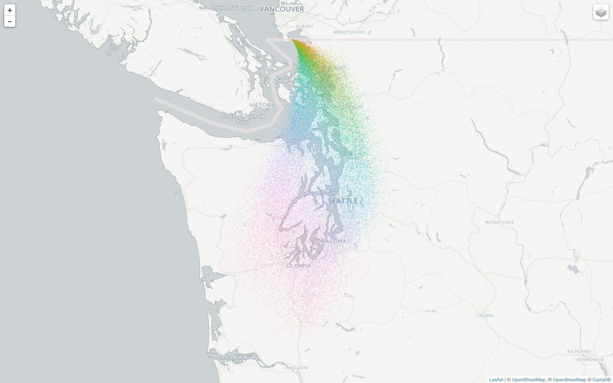

[](https://zenodo.org/badge/latestdoi/20543/rich-iannone/SplitR)

**SplitR** is an **R** package for conducting trajectory and dispersion modeling with **HYSPLIT**. You can determine where air (came from | is going), or, where gas-phase or particulate matter (came from | is going). It's a means to help explain how, where, and when chemicals and materials are atmospherically transported, dispersed, and deposited.

This model has many applications. Some have modeled the atmospheric transport of moisture to determine probable extreme rainfall locations leading to flood events ([Gustafsson et al., 2010](http://tellusa.net/index.php/tellusa/article/view/15715)). Similarly, [Creamean et al., 2013](http://science.sciencemag.org/content/339/6127/1572.full) have presented a direct link between long-range transported dust and biological aerosols affecting cloud ice formation and precipitation processes in western United States.

Others have successfully improved understanding of invasive species dispersal abilities to inform conservation and landscape management ([Lander et al., 2014](http://onlinelibrary.wiley.com/doi/10.1002/ece3.1206/abstract)). Along similar lines, the long-distance transport of high-risk plant pathogens can be modeled with **HYSPLIT** to assist with plant disease management decisions, such as applications of fungicide or pesticide to potentially-affected agricultural areas ([Schmale and Ross, 2015](http://www.annualreviews.org/doi/abs/10.1146/annurev-phyto-080614-115942?journalCode=phyto)).

**SplitR** allows you to build and run **HYSPLIT** models in a fast, easy, and organized manner. A few or, perhaps, thousands of trajectory or dispersion runs can be conducted with minimal code. Because **SplitR** is an **R** interface to **HYSPLIT**, we can store output in memory and take advantage of the vast selection of **R** packages to perform statistical analyses and to generate visualizations. This package furthermore simplifies the process of running **HYSPLIT** models by automating the retrieval and storage of associated meteorological data files.

Some of the things you can do with **SplitR** are:

- create and execute model runs with an easily readable **magrittr** pipeline workflow
- run multiple trajectory and dispersion model runs (forward or backward) with multiple temporal and spatial variations
- visualize wind trajectories and particle positions throughout trajectory and dispersion runs
- use the returned `tbl_df` object with **dplyr** to `filter()`, `select()`, `group_by()`, `summarize()`, `mutate()`, and `transmute()` the model output data

## **HYSPLIT** Trajectory Model Runs

To perform a series of **HYSPLIT** trajectory model runs, one can use the **SplitR** `hysplit_trajectory()` function:

```R
library(SplitR)

setwd("~/Documents/SplitR_wd")

trajectory <- 
  hysplit_trajectory(
    lat = 42.83752,
    lon = -80.30364,
    height = 50,
    duration = 24,
    run_period = "2012-03-12",
    daily_hours = c(0, 6, 12, 18),
    direction = "forward",
    met_type = "gdas1",
    extended_met = TRUE) 
```

This use of `hysplit_trajectory()` sets up four trajectory runs that start at 00:00, 06:00, 12:00, and 18:00 UTC on March 12, 2012 (using `run_period = "2012-03-12"` and `daily_hours = c(0, 6, 12, 18)`). Several years of runs can be initiated using `run_period = c(2012, 2014)`, model runs can be performed between a range of dates as well (`run_period = c("2012-03-12", "2013-05-23")`). These runs are 24 h in duration (`duration = 24`). 

The receptor/origin locations are set using `lat` and `lon` for the latitude(s) and longitude(s). The starting location of 42.83752ºN and 80.30364ºW is set here using `lat = 42.83752` and `lon = -80.30364`. Equal-length vectors of `lat` and `lon` values can be used here to create an ensemble of model runs. The starting height of 5 m above ground level is set by `height = 5`.

The model runs as set above are forward runs (moving forward in time, set here using `direction = "forward"`) and not backtrajectory runs (set with `direction = "backward"`).

The meteorological options include the type of met data to use. The 1º **GDAS** data is used here with `met_type = "gdas1"` but there is also the option to use **NCEP** reanalysis data with the `met_type = "reanalysis"` setting and **NARR** (North American Regional Reanalysis) data with `met_type = "narr"`. The necessary meteorological data files relevant to the period being modeled will be downloaded from the **NOAA** FTP server if they are not present in the working directory.

The function will return a data frame containing trajectory information. The data frame (named here as the object `trajectory`) will be have the following columns when `extended_met` is set to `FALSE`:

- `receptor` a numeric label for the receptor
- `year`, `month`, `day`, `hour` integer values for date/time components
- `hour.inc` the integer hour difference compared to the run starting time
- `lat`, `lon`, `height` the latitude, longitude, and height (meters above ground level) of the air mass along the trajectory
- `pressure` the air pressure along the trajectory (in hPa)
- `date2` a POSIXct date-time value (in UTC) for the air mass along the trajectory
- `date` a POSIXct date-time value (in UTC) for the time of release or time of incidence at the receptor site

If the model is run with `extended_met` set to `TRUE` then the following columns will also be available in the output data frame:

- `theta` the potential temperature (in K) along the trajectory
- `air_temp` the ambient air temperature (in K) along the trajectory
- `rainfall` the rate of rainfall (in mm/h) along the trajectory
- `mixdepth` the mixing depth (or mixing height, in meters) along the trajectory
- `rh` the relative humidity along the trajectory
- `sp_humidity` the specific humidity (in g/kg) along the trajectory
- `h2o_mixrate` the mixed layer depth (in meters) along the trajectory
- `terr_msl` the terrain height at the location defined by `lat` and `long`
- `sun_flux` the downward solar radiation flux (in watts) along the trajectory

Models can also be defined and executed using a modeling object in a **magrittr** workflow. Here's an example:

```R
library(SplitR)
library(magrittr)

setwd("~/Documents/SplitR_wd")

# Create the `trajectory_model` object, add
# a grid of starting locations, add run
# parameters, and execute the model runs
trajectory_model <-
  create_traj_model() %>%
  add_grid(
    lat = 49.0,
    lon = -123.0,
    range = c(0.8, 0.8),
    division = c(0.2, 0.2)) %>%
  add_params(
    height = 50,
    duration = 6,
    run_period = "2015-07-01",
    daily_hours = c(0, 12),
    direction = "backward",
    met_type = "reanalysis") %>%
  run_model()
```

Here, we create a `trajectory_model` object which serves as a container for the model definition and for the results. Read left to right, the order of operations is: `create_traj_model()` -> `add_grid()` -> `add_params` -> `run_model()`.

This pipeline setup allows for more flexibility as **R** objects can be piped in for variation in the types of models created. The `create_traj_model()` function creates the trajectory model object. The `add_grid()` allows for the simple creation of a grid for multiple starting locations in an ensemble run. As shown, a grid centered on 49ºN and 123ºW has bounds 0.8º in each direction and grid points at every 0.2º in each direction. One or more `add_params()` statements can be used to write model parameters to the model object. Ending the pipeline with `run_model()` runs the model and creates results.

The trajectory data can be be extracted from the trajectory model object using `get_output_df()`...

```R
# Get a data frame containing the model results
trajectory_df <-
  trajectory_model %>% get_output_df()
```

...and a `tbl_df` (tibble) object is now available:

```R
trajectory_df
#> Source: local data frame [175 x 21]
#> 
#>    receptor  year month   day  hour hour.inc    lat      lon height
#>       (int) (int) (int) (int) (int)    (dbl)  (dbl)    (dbl)  (dbl)
#> 1         1    15     7     1     0        0 49.400 -123.400   50.0
#> 2         1    15     7     1     1        1 49.359 -123.203   49.9
#> 3         1    15     7     1     2        2 49.326 -123.039   49.3
#> 4         1    15     7     1     3        3 49.300 -122.905   48.2
#> 5         1    15     7     1     4        4 49.282 -122.800   46.7
#> 6         1    15     7     1     5        5 49.268 -122.723   44.8
#> 7         1    15     7     1     6        6 49.260 -122.672   42.5
#> 8         2    15     7     1     0        0 49.400 -123.200   50.0
#> 9         2    15     7     1     1        1 49.369 -123.008   49.9
#> 10        2    15     7     1     2        2 49.346 -122.848   49.4
#> ..      ...   ...   ...   ...   ...      ...    ...      ...    ...
#> Variables not shown: pressure (dbl), date2 (time), date (time), theta
#>   (dbl), air_temp (dbl), rainfall (dbl), mixdepth (dbl), rh (dbl),
#>   sp_humidity (dbl), h2o_mixrate (dbl), terr_msl (dbl), sun_flux (dbl)
```

#### Plotting Trajectory Data

Trajectories can be plotted onto an interactive map. Use the `trajectory_plot()` function with either the `trajectory` data frame (created directly by the `hysplit_trajectory()` function), or, even better, with a trajectory model object.

```R
library(SplitR)
library(magrittr)

# Plot results using the trajectory data frame
trajectory_plot(trajectory)

# Plot results using the trajectory model object
trajectory_model %>% trajectory_plot()
```

The visualization will appear in the **RStudio** Viewer:


The trajectory points and paths are layers where their visibility can be toggled using the *Layers* icon at the top-right of the view. The following selection of basemaps is also provided:

- CartoDB Dark Matter
- CartoDB Positron
- ESRI World Terrain
- Stamen Toner

Clicking any of the points along the trajectory will provide an informative popup with time/position info and meteorological data for that location at that point in time:


## **HYSPLIT** Dispersion Runs

Dispersion models can also be conveniently built and executed using a **magrittr** workflow. Instantiate the dispersion model with the `create_disp_model()` function. Use one or more `add_params()` statements to write parameters to the model object. The `add_grid()` function here facilitates the creation of sampling grids. Using `add_emissions()` function anywhere in the pipeline will define emissions properties for one or more emitted pollutants. With `add_species()`, the physical properties and deposition parameters of one or more emitted species can be added to the model.

As with the trajectory model, the pipeline can ended with `run_model()`. To extract a data frame containing the modeled output data, use the `get_output_df()` function. An example is in order:

```R
library(SplitR)
library(magrittr)

setwd("~/Documents/SplitR_wd")

# Create the `dispersion_model` object, add
# a grid of starting locations, add run
# parameters, and then execute the model run
dispersion_model <-
  create_disp_model() %>%
  add_emissions(
    rate = 5,
    duration = 6,
    start_day = "2015-07-01",
    start_hour = 0) %>%
  add_species(
    pdiam = 1,
    density = 1,
    shape_factor = 1) %>%
  add_grid(
    range = c(0.5, 0.5),
    division = c(0.1, 0.1)) %>%
  add_params(
    lat = 49.0,
    lon = -123.0,
    height = 50,
    duration = 24,
    start_day = "2015-07-01",
    start_hour = 0,
    direction = "forward",
    met_type = "reanalysis") %>%
  run_model()
```

This dispersion model formally begins at 00:00 UTC on July 1, 2015 (using `start_day = "2015-07-01"` and `start_hour = 0`). The model run is a forward run (i.e., moving forward in time, with `direction = "forward"`) and not backwards (would be set as `direction = "backward"`). Essentially, running in forward mode means the starting location is a source of emissions; running backward means that the starting location is a receptor.

This run has been set to be modeled for 24 h (`duration = 24`). The starting location of 49.0ºN and 123.0ºW is set using `lat = 49.0` and `lon = -123.0`; the starting height of 50 m above ground level is set by `height = 50`. The meteorological options include the type of met data to use (global NCEP Reanalysis data is used here with `met_type = "reanalysis`).

A single emissions species is set to be emitted (using `add_emissions()`) for 6 hours (`duration = 6`) at an emission rate of 5 mass units per hour (`rate = 5`). Emissions begin at the same time as the start of the model (`start_day = "2015-07-01"` and `start_hour = 0`). The properties of the emitted pollutant are defined using `add_species()`. Here, the physical properties of particle diameter (in micrometers), density (in grams per cubic centimeter), and shape factor (value from 0 to 1), respectively, are defined with `pdiam = 1`, `density = 1`, and `shape_factor = 1`.

It should be noted that the order of `add_emissions()`, `add_species()`, `add_grid()`, and `add_params()` does not matter. There can even be several instances of each of these functions throughout the pipeline.

All meteorological data files needed to execute the model during the defined period will be downloaded from the **NOAA** FTP server if such files are not already present in the working directory.

The output data can be extracted from the dispersion model object...

```R
# Get a data frame containing the model results
dispersion_df <-
  dispersion_model %>% get_output_df()
```

...and the data is conveniently supplied as a tibble object:

```R
dispersion_df
#> Source: local data frame [54,063 x 5]
#> 
#>    particle_no       lon     lat height  hour
#>          (int)     (dbl)   (dbl)  (dbl) (int)
#> 1            1 -122.8368 48.9499    711     1
#> 2            2 -122.8419 48.9311    780     1
#> 3            3 -122.8531 48.9108    848     1
#> 4            4 -122.8401 48.9365    647     1
#> 5            5 -122.8472 48.9389    124     1
#> 6            6 -122.8124 48.9449     10     1
#> 7            7 -122.8263 48.9316    935     1
#> 8            8 -122.8144 48.9631    265     1
#> 9            9 -122.8313 48.9465    278     1
#> 10          10 -122.8105 48.9326    250     1
#> ..         ...       ...     ...    ...   ...
```

#### Plotting Dispersion Data

Dispersion data can also be plotted onto a map. Use the `dispersion_plot()` function with the dispersion model object.

```R
library(SplitR)
library(magrittr)

# Plot particle data onto a map
dispersion_model %>% dispersion_plot()
```

The visualization will appear in the **RStudio** Viewer:



The dispersed particles at every hour are present as map layers, where their visibility can be toggled using the *Layers* icon at the top-right of the view.

## Installation

**SplitR** is used in an **R** environment. If you don't have an **R** installation, it can be obtained from the [**Comprehensive R Archive Network (CRAN)**](http://cran.rstudio.com). It is recommended that [**RStudio**](http://www.rstudio.com/products/RStudio/) be used as the **R** IDE to take advantage of its ability to visualize output in its *Viewer* pane.

You can install the development version of **SplitR** from **GitHub** using the **devtools** package.

```r
devtools::install_github("rich-iannone/SplitR")
```

## HYSPLIT Citations

Stein, A.F., Draxler, R.R, Rolph, G.D., Stunder, B.J.B., Cohen, M.D., and Ngan, F., (2015). NOAA's HYSPLIT atmospheric transport and dispersion modeling system, Bull. Amer. Meteor. Soc., 96, 2059-2077, http://dx.doi.org/10.1175/BAMS-D-14-00110.1

Draxler, R.R., 1999: HYSPLIT4 user's guide. NOAA Tech. Memo. ERL ARL-230, NOAA Air Resources Laboratory, Silver Spring, MD.

Draxler, R.R., and G.D. Hess, 1998: An overview of the HYSPLIT_4 modeling system of trajectories, dispersion, and deposition. Aust. Meteor. Mag., 47, 295-308.
